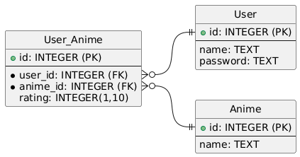

# Anime recommendations

Uses collaborative filtering with the fastai and pytorch frameworks.

- [export dir](./export) is generated from the [ML notebook](./anime.ipynb)
- Using python for backend due to having stuff like numpy, and integrating better with the training.
- Sqlite3 for DB

Plantuml DB diagram:

## Todo

Maybe expand the project to also include movies, tv-shows, games, books, manga, comics, etc from various datasources like opencritic, movielens etc
would need to train a specific model for each type of media, unless i find some way of doing collaborative filtering with merged data (which i don't think would work as the user-id's are different for the various sites), but i might be able to combine it for the temp user vector we generate for the frontend

## Data sources

- [anime-reviews](https://www.kaggle.com/code/juanluisrosa/anime-reviews) (a year old so the model won't recommend shows that have been recently made, might scrape myanimelist or another similar site on my own to get more up to date data)
- [anime-metadata](https://github.com/manami-project/anime-offline-database/releases/tag/2026-12)
